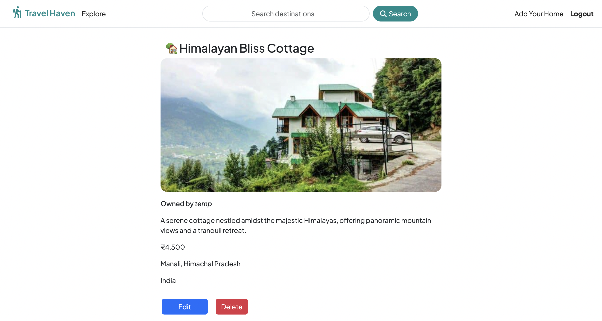
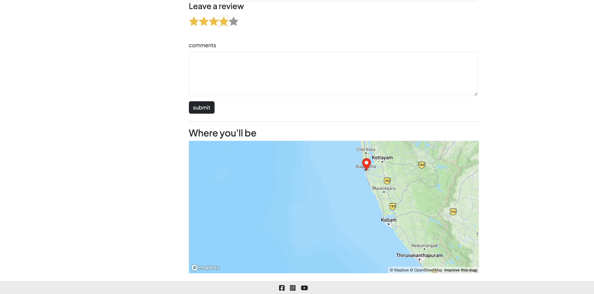

# TravelHaven 🧳✈️

[](https://opensource.org/licenses/MIT)
[](https://nodejs.org/)
[](https://www.mongodb.com/)

**TravelHaven** is a comprehensive web application designed to help travelers plan, organize, and share their adventures. Discover new destinations, create personalized itineraries, and connect with a community of fellow travel enthusiasts.

## ✨ Features

- **🌍 Destination Discovery** - Explore curated destinations with rich details and local insights
- **📅 Itinerary Builder** - Create day-by-day travel plans with activities, accommodations, and transportation
- **⭐ Reviews & Ratings** - Share your experiences and learn from fellow travelers
- **🔖 Bookmarking** - Save your favorite destinations for future adventures
- **📱 Responsive Design** - Seamless experience across desktop, tablet, and mobile devices

## 🖼️ Screenshots

<div align="center">
  <table>
    <tr>
      <td align="center">
        <br>
        <em>Home Page</em>
      </td>
      <td align="center">
        <br>
        <em>Listing Details</em>
      </td>
    </tr>
    <tr>
      <td align="center" colspan="2">
        <br>
        <em>Reviews and map</em>
      </td>
    </tr>
  </table>
</div>

## 🌐 Live Demo

> 🚧 **Coming Soon!** The live demo is currently under development and will be available here upon deployment.

## 🚀 Getting Started

### Prerequisites

- [Node.js](https://nodejs.org/) (v16 or later)
- [MongoDB](https://www.mongodb.com/) (local or Atlas)
- [Cloudinary](https://cloudinary.com/) account for media storage

### Installation

1. **Clone the repository**

   ```bash
   git clone https://github.com/AbhiK1237/TravelHaven.git
   cd TravelHaven
   ```

2. **Install dependencies**

   ```bash
   npm install
   ```

3. **Create environment variables**

   Create a `.env` file in the project root with the following:

   ```env
   # Cloudinary Configuration
   CLOUDINARY_CLOUD_NAME=your_cloud_name
   CLOUDINARY_API_KEY=your_api_key
   CLOUDINARY_API_SECRET=your_api_secret
   
   # MongoDB Connection
   MONGODB_URI=your_mongodb_connection_string
   
   # Application Security
   SESSION_SECRET=your_session_secret
   
   # Optional: Port Configuration
   PORT=3000
   ```

4. **Start the application**

   ```bash
   # Development mode with auto-reload
   npm run dev
   
   # Production mode
   npm start
   ```

5. **Open your browser**

   Navigate to `http://localhost:3000` to access TravelHaven

## 📁 Project Structure

```
TravelHaven/
├── 📂 controllers/       # Request handlers and business logic
├── 📂 models/            # MongoDB schemas and data models
├── 📂 routes/            # API and page routing
├── 📂 views/             # EJS templates for frontend
├── 📂 public/            # Static assets
│   ├── 📂 css/           # Styling
│   ├── 📂 js/            # Client-side scripts
│   └── 📂 images/        # Static images
├── 📂 utils/             # Utility and helper functions
├── 📂 middleware/        # Custom Express middleware
├── 📄 app.js             # Application entry point
├── 📄 cloudConfig.js     # Cloudinary configuration
├── 📄 package.json       # Dependencies and scripts
└── 📄 .gitignore         # Git ignore rules
```

## 🛠️ Tech Stack

### Backend
- **[Node.js](https://nodejs.org/)** - JavaScript runtime
- **[Express](https://expressjs.com/)** - Web framework
- **[Mongoose](https://mongoosejs.com/)** - MongoDB object modeling

### Frontend
- **[EJS](https://ejs.co/)** - Embedded JavaScript templates
- **[CSS3](https://developer.mozilla.org/en-US/docs/Web/CSS)** - Custom styling
- **[JavaScript](https://developer.mozilla.org/en-US/docs/Web/JavaScript)** - Client-side functionality

### Authentication & Sessions
- **[express-session](https://www.npmjs.com/package/express-session)** - Session management
- **[connect-flash](https://www.npmjs.com/package/connect-flash)** - Flash messages
- **[passport](https://www.passportjs.org/)** - Authentication

### Media Storage
- **[Cloudinary](https://cloudinary.com/)** - Cloud-based image and video management

## 📝 Available Scripts

| Command | Description |
|---------|-------------|
| `npm start` | Starts the application in production mode |
| `npm run dev` | Starts the application with nodemon for development |
| `npm test` | Runs the test suite |
| `npm run lint` | Lints the codebase using ESLint |

## 🤝 Contributing

Contributions are always welcome! Here's how you can help:

1. **Fork the repository**
2. **Create a feature branch**
   ```bash
   git checkout -b feature/amazing-feature
   ```
3. **Commit your changes**
   ```bash
   git commit -m 'Add some amazing feature'
   ```
4. **Push to your branch**
   ```bash
   git push origin feature/amazing-feature
   ```
5. **Open a Pull Request**

Please ensure your code adheres to our coding standards and includes appropriate tests.

## 👥 Author

- **[AbhiK1237](https://github.com/AbhiK1237)** - *Initial work*

---

